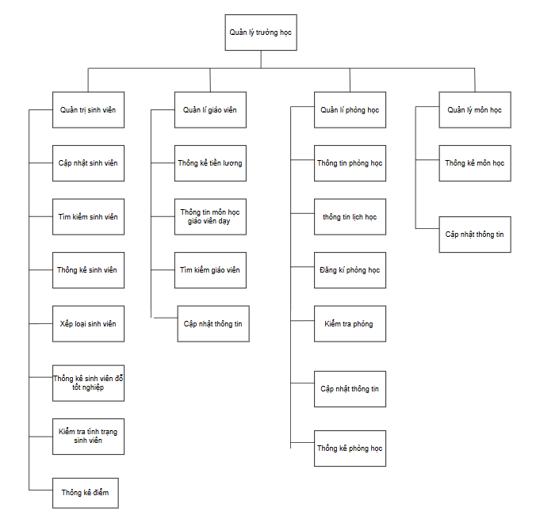
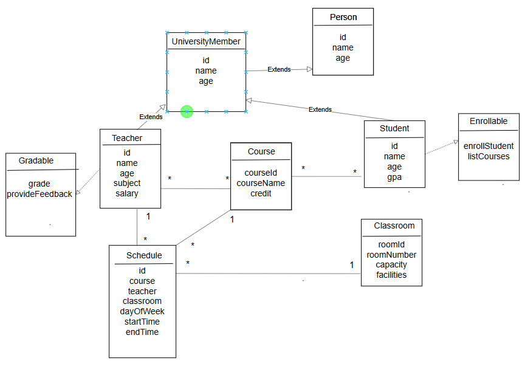

Quản lí trường học :

Hệ thống cho phép sinh viên đăng ký nhiều môn học, giáo viên được phân công giảng dạy và chấm điểm,
đăng kí lớp học để giảng dạy theo ngày giờ và lớp còn trống,
đồng thời cung cấp các chức năng thống kê – tính toán để hỗ trợ nhà trường.

2. Thành phần chính 
Sinh viên (Student) có các thuộc tính :
   -Mã sinh viên
   -Tên sinh viên
   -Tuổi
   -GPA
   Có thể đăng ký nhiều môn học.
   Nhận điểm từ giáo viên.

Giáo viên (Teacher) có các thuộc tính:
   -Mã giáo viên
   -Tên
   -Tuổi
   -Môn dạy
   -Lương
Được phân công giảng dạy một hoặc nhiều môn học.
Có thể chấm điểm sinh viên.

Môn học (Course) có các thuộc tính:
   -Mã môn học
   -Tên môn học
    -Số tín
Được nhiều sinh viên đăng ký.
Có một hoặc nhiều giáo viên phụ trách giảng dạy.

Phòng học(Classroom) có các thuộc tính :
    -Mã phòng học
    -Số lớp học
    -Sức chứa
    -Trạng thái phòng
Giáo viên đăng kí phòng học môn học tương ứng môn học của giáo viên
theo giờ trong tuần từ thứ 2 đến chủ nhật đang ở trạng thái còn chỗ.

3. Chức năng chính

Quản lý Sinh viên:
  + Thêm, sửa, xóa thông tin sinh viên.

Quản lý Giáo viên
  + Cập nhật thông tin giáo viên: thêm, sửa ,xóa
  + Phân công giảng dạy môn học.
  + Chấm điểm cho sinh viên.
  + Đăng kí phòng học.

Quản lý Môn học
 + Thêm, sửa, xóa môn học.
 + Xem danh sách sinh viên đã đăng ký.
 + Xem giáo viên phụ trách.

Thống kê & Tính toán
+ Kiểm tra nhập trùng Id
+ Tìm kiếm sinh viên theo: Id, Tên ,Địa chỉ
+ Thống kê sinh viên đăng kí bao nhiêu tín chỉ
+ Thống kê học phí sinh viên
+ Thống kê tiền lương giáo viên
+ Thông kê sinh viên đủ điều kiện tốt nghiệp
+ Tổng số tín chỉ sinh viên đã đăng kí
+ In ra thống kê sinh viên, môn học, giáo viên
+ Số lượng sinh viên đăng ký theo môn học.
+ Số môn học mà mỗi sinh viên đăng ký.
+ Số môn học mà mỗi giáo viên giảng dạy.
+ Lọc thông tin sinh viên theo yêu cầu
+ Thông kê sinh viên theo độ tuổi
+ Điểm trung bình của sinh viên theo môn học.
+ Danh sách sinh viên giỏi, khá, trung bình, yếu.
+ Xếp hạng sinh viên trong lớp theo điểm số.
+ Thống kê số lượng sinh viên theo độ tuổi.
+ Môn học giáo viên giảng dạy
+ Quản lý Phòng học
+ Quản lý Lịch học
+ Hủy đăng kí phòng học
+ Đăng kí phòng học
+ Kiểm tra lớp còn trống

Các kiến thức đã ứng dụng trong bài toán trên:
**1. Cú pháp cơ bản của Kotlin**

- Biến & Hằng số
- Kiểu dữ liệu (Int, Float, Boolean, String, Char, Double, Long)
- Toán tử (+, -, *, /, %, +=, -=, ==, !=, >, <, &&, ||)
- Ép kiểu (toInt(), toString(), toDouble(),...)
- Chuỗi & String Template ("Hello, $name")

**2. Cấu trúc điều kiện và vòng lặp**

- If - Else
- When 
- For Loop (for (i in 1..10) { })
- While & Do-While Loop ,....

**3. Collection (Danh sách dữ liệu)**

- List (Danh sách)
- Set (Tập hợp không trùng lặp)
- Map (Dạng key-value)
- Các hàm quan trọng trong Collection

map(), filter(), reduce(),
forEach(), first(), last(), ...

**4. Hàm & Extension Function**

- Hàm thông thường
- Hàm một dòng
- Default Parameter & Named Argument
- Extension Function

**5. Null Safety (An toàn với null)**

- Nullable (?) và Non-nullable
- Elvis Operator (?:)
- Safe Call (?.)

**6. Lập trình hướng đối tượng (OOP) trong Kotlin**

- Class & Object
- Constructor (Primary & Secondary)
- Kế thừa (open class, override)
- Interface & Abstract Class
- Data Class
- Singleton & Companion Object

**7. Higher-Order Function & Lambda**

- Hàm là tham số của hàm khác
- Lambda Expression ({ x, y -> x + y })
- Inline Function
- Higher-Order Function (fun operation(a: Int, b: Int, action: (Int, Int) -> Int))

**8. Coroutine (Lập trình bất đồng bộ)**

- Suspend Function (suspend fun fetchData())
- Launch & Async
- Dispatcher (Dispatchers.Main, [Dispatchers.IO](http://dispatchers.io/))
- Scope (GlobalScope, CoroutineScope)

**9. Các kiến thức nâng cao**

- Sealed Class & Enum Class
- Generics (fun <T> add(a: T, b: T))

